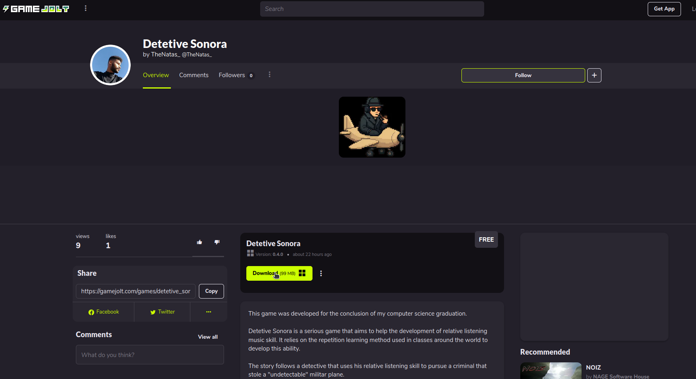
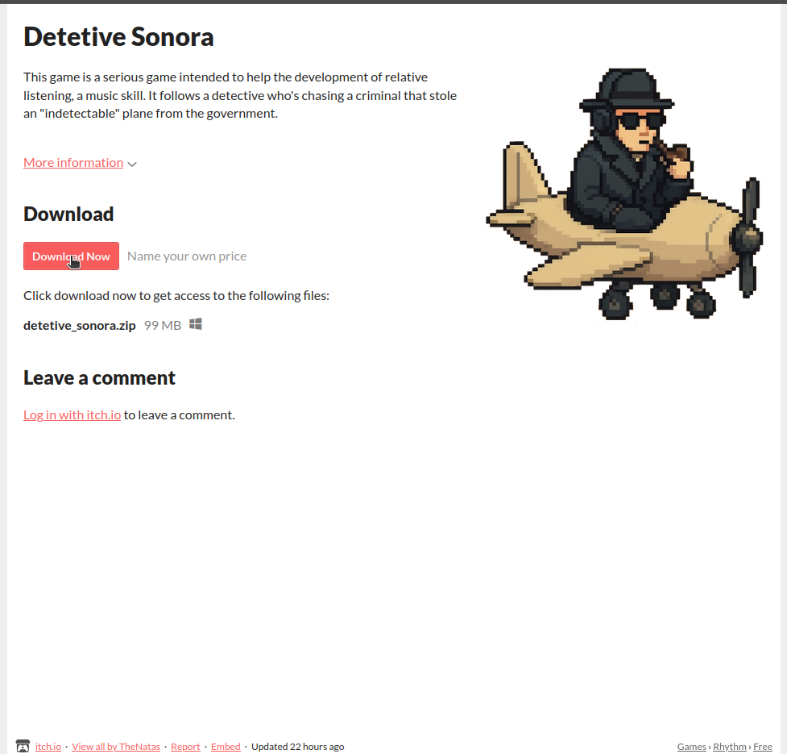
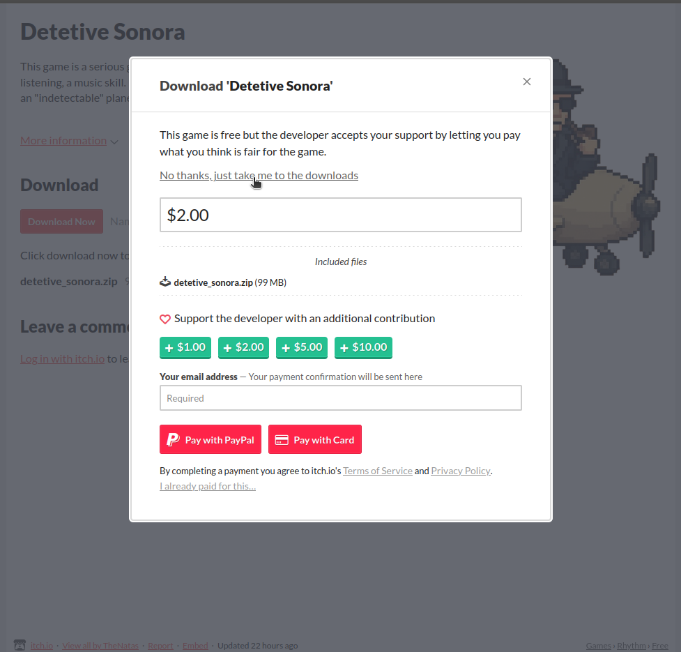
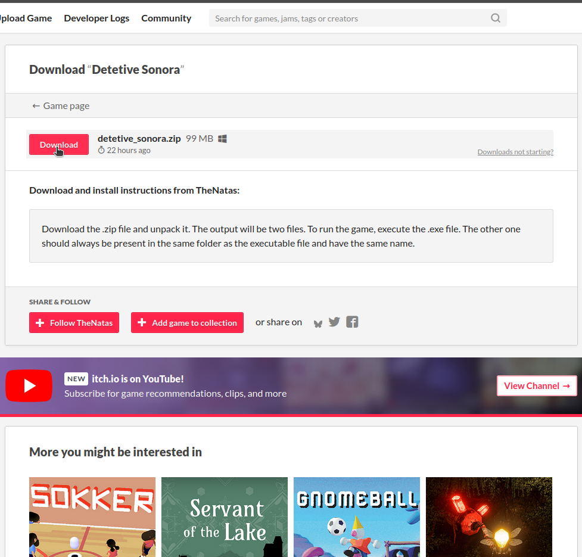

# Detetive Sonora

Guia rápido para baixar, instalar e executar o jogo.

## Download

Acesse um dos links de download do jogo (Game Jolt ou itch.io) e clique no botão "Download".

### Game Jolt

### itch.io

1) Página do jogo — clique em "Download Now":

2) Janela de confirmação — clique em "No thanks, just take me to the downloads":

3) Página de downloads — clique no botão "Download" para baixar o arquivo .zip:

## Instalação

- Descompacte o arquivo .zip (detetive_sonora.zip).

## Execução

- Execute o arquivo .exe (detetive sonora.exe).

## Observações

- Para rodar, o arquivo executável (.exe) deve estar na mesma pasta que o arquivo .pck e também possuir o mesmo nome (detetive sonora.exe e detetive sonora.pck).

## Links

- GameJolt: https://gamejolt.com/games/detetive_sonora/1026107
- itch.io: https://thenatas.itch.io/detetive-sonora
